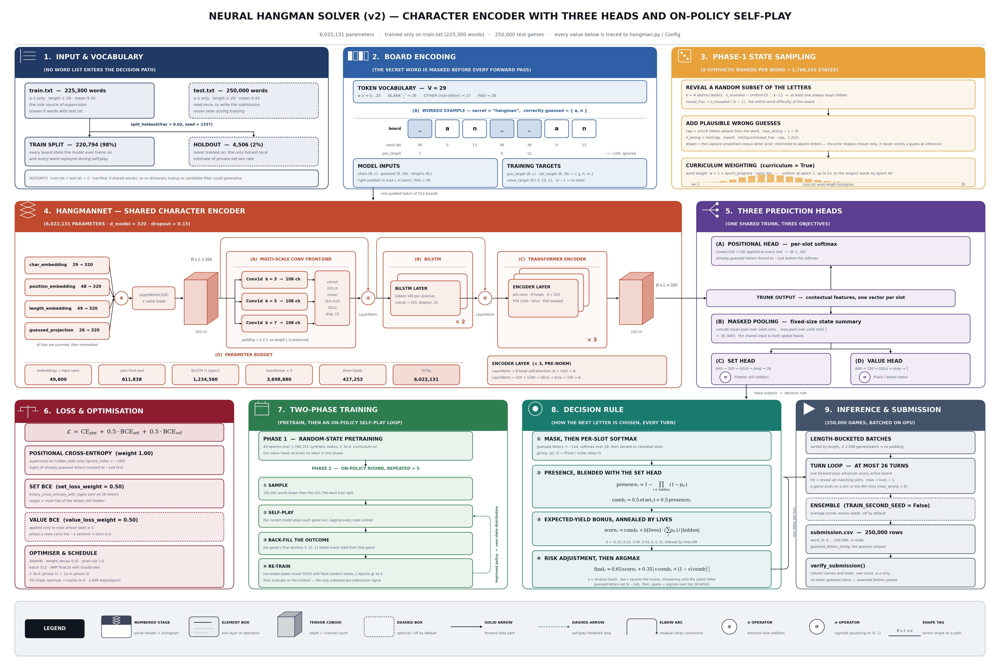

# Neural Hangman Solver (v2)

**68.38% win rate on the private test set** — Brand & Buzzword Hackathon, hosted by Meltwater.

A pure sequence model that plays Hangman. Given a partially revealed word, it picks the
next letter; six wrong guesses lose the game. The model is trained **only** on
`train.txt` — there is no dictionary lookup, no candidate filtering, and no test-set
access anywhere in the decision path.

That constraint is not stylistic. `train.txt` and `test.txt` share **zero** words
(verified: `len(set(train) & set(test)) == 0`), so any approach that filters a candidate
list built from the training vocabulary would score at chance on the evaluation set. The
model has to learn orthography, not memorise words.

| | |
|---|---|
| Training vocabulary | `train.txt` — 225,300 words, `a–z` only, length 1–29, mean 9.35 |
| Evaluation set | `test.txt` — 250,000 words, `a–z` only, length 2–29, mean 9.43 |
| Overlap | 0 words |
| Model | 6,022,131 parameters — conv + BiLSTM + transformer trunk, three heads |
| Training | 40 epochs of synthetic states, then 5 rounds of on-policy self-play |
| Output | `submission.csv` — 250,000 rows of `word_id, guessed_letters_string` |
| **Result** | **68.38% win rate on the private test set** |

---

## The competition

**Brand & Buzzword Hackathon**, hosted by **Meltwater** — 48 hours, solo entry,
1–3 September 2026.

A code competition: entrants submit a notebook rather than a predictions file, and scoring
runs the submitted code against a secret test set. Final judging used a firewalled private
evaluation set, separate from the public leaderboard.

| | |
|---|---|
| Primary metric | Win rate — percentage of words fully revealed within 6 wrong guesses |
| Tie-break | Total wrong guesses across all words, as a fractional penalty behind the decimal |
| Public test set | 250,000 words |
| **Private test set score** | **68.38% win rate** |

Beyond the score, entries were judged on algorithmic sophistication (deep learning weighted
above n-gram and frequency heuristics), generalization integrity (hardcoding or lookup leaks
meant disqualification), and code cleanliness. This solution was built against all three.

### Rules that shaped the design

- **Any guess that reveals nothing costs a life** — an incorrect letter, but also a
  *repeated* one. So the simulator never guesses the same letter twice, and
  `verify_submission` asserts that property across all 250,000 rows before upload.
- **Six-strike lockout.** Once the sixth wrong guess lands, the rest of the guess string is
  ignored. There is nothing to gain from padding it, so each game stops on a win or the
  sixth miss.
- **Non-letter characters are visible from the start.** `encode_board` gives them their own
  token, though in practice neither provided list contains any.
- **No external API calls.** The model is self-contained and trained only on `train.txt`.

---

## Architecture

The whole pipeline in one figure — data, model, training, decision rule and inference.



Regenerate it (PNG at 220 dpi to the repo root, plus SVG and PDF into `figures/`):

```bash
python figures/make_architecture_figure.py
```

It needs only `matplotlib` and `numpy`, is deterministic, and reads no external files.

### The nine panels

| # | Panel | What it covers |
|---|-------|----------------|
| 1 | **Input & vocabulary** | The two word lists, the 98/2 train/holdout split at `seed=1337`, and the disjointness that rules out dictionary methods. |
| 2 | **Board encoding** | How `(secret word, revealed letters)` becomes token ids, the 29-token vocabulary, and the per-slot and per-letter training targets. |
| 3 | **Phase-1 state sampling** | How 1,766,352 synthetic board states are drawn from 220,794 words: random reveals, plausible misses from the corpus letter prior, and length-based curriculum weighting. |
| 4 | **HangmanNet — shared character encoder** | The trunk: four additive embeddings → multi-scale Conv1d → BiLSTM → 3 transformer layers, with residual connections and a parameter budget. |
| 5 | **Three prediction heads** | The per-slot positional head, and the masked mean+max pooling that feeds the global set head and value head. |
| 6 | **Loss & optimisation** | The three-term objective, its weights and masks, and the AdamW / warmup-cosine schedule. |
| 7 | **Two-phase training** | Random-state pretraining, then the self-play loop that harvests board states and back-fills win/loss labels for the value head. |
| 8 | **Decision rule** | How the three head outputs combine into one score per candidate letter, and how the letter is chosen. |
| 9 | **Inference & submission** | Length-bucketed batched game simulation, optional ensembling, and the submission schema checks. |

---

## Layer → output shape

`B` = batch size, `L` = padded word length in the batch. Parameter counts are exact.

| Stage | Operation | Output shape | Parameters |
|---|---|---|---|
| input | `chars` (token ids), `guessed` (multi-hot), `lengths` | `(B, L)`, `(B, 26)`, `(B,)` | — |
| embed | `char_embedding(29, 320)`, `padding_idx=28` | `(B, L, 320)` | 9,280 |
| embed | `+ position_embedding(48, 320)` | `(B, L, 320)` | 15,360 |
| embed | `+ length_embedding(49, 320)` | `(B, L, 320)` | 15,680 |
| embed | `+ guessed_projection: Linear(26 → 320)` | `(B, L, 320)` | 8,640 |
| norm | `LayerNorm(320)`, then × valid mask | `(B, L, 320)` | 640 |
| conv | `Conv1d(320 → 106)` at k = 3, 5, 7; concatenated | `(B, L, 318)` | 509,118 |
| conv | `Linear(318 → 320)` → GELU → dropout 0.15 | `(B, L, 320)` | 102,080 |
| conv | residual add + `LayerNorm(320)` | `(B, L, 320)` | 640 |
| rnn | `BiLSTM`, 2 layers, hidden 160 per direction | `(B, L, 320)` | 1,233,920 |
| rnn | residual add + `LayerNorm(320)` | `(B, L, 320)` | 640 |
| attn | `TransformerEncoderLayer × 3` — pre-norm, 8 heads, FFN 1280, GELU | `(B, L, 320)` | 3,698,880 |
| head | **positional head**: `Linear(320 → 26)` per slot | `(B, L, 26)` | 8,346 |
| pool | masked mean-pool ‖ masked max-pool over valid slots | `(B, 640)` | — |
| head | **set head**: `640 → 320 → GELU → dropout → 26` | `(B, 26)` | 213,466 |
| head | **value head**: `640 → 320 → GELU → dropout → 1` | `(B,)` | 205,441 |
| | **Total** | | **6,022,131** |

Padded positions are excluded three ways: by `padding_idx` on the character embedding, by
the `valid` mask applied after each normalisation, and by `src_key_padding_mask` in the
transformer.

---

## The three heads

| Head | Supervision | Used at inference for |
|---|---|---|
| **Positional** — per-slot softmax over 26 letters | Cross-entropy on hidden slots only (`ignore_index = -100`) | `presence`: the probability a letter occupies *at least one* hidden slot |
| **Set** — one sigmoid per letter | BCE against the multi-hot set of still-hidden letters | A direct estimate of the same event, blended 50/50 with `presence` |
| **Value** — one sigmoid | BCE against the game's eventual win/loss, harvested from self-play | A risk signal that sharpens the score when the position is precarious |

The value head has no label during phase 1. Those rows carry a `-1.0` sentinel and the
loss code masks them out, so the same batch format serves both phases.

---

## Training

**Phase 1 — random-state pretraining.** 40 epochs over 1,766,352 synthetic board states
(8 per training word, resampled fresh on every draw). For a word with `k` distinct
letters, a random subset of size `0 … k-1` is revealed — at least one letter always stays
hidden. Wrong guesses are then drawn in proportion to the Laplace-smoothed corpus letter
frequency, restricted to letters absent from the word, so misses look like misses a real
player would make. A curriculum shifts sampling weight toward longer words as training
progresses (`w = 1 + epoch_progress · norm_len`).

**Phase 2 — on-policy fine-tuning.** Five rounds. Each round samples 100,000 training
words, has the current model play every game to its end, and logs every
`(word, revealed, guessed)` state visited. When a game finishes, its win/loss outcome is
back-filled onto every state from that game — that is what labels the value head. Those
states are mixed 50/50 with fresh random states and trained for 2 epochs at `lr 1e-4`.
The loop closes because a better policy visits a different distribution of states.

Holdout win rate is reported after pretraining and after every round. The 4,506-word
holdout is never trained on and is the only unbiased signal available before submission.

### Configuration

Values below are from the `Config` constructed in notebook cell 8; anything not passed
there uses the `Config` dataclass default.

| Group | Setting | Value |
|---|---|---|
| Data | `holdout_frac`, `max_len`, `seed` | 0.02, 48, 1337 |
| Model | `d_model`, `n_lstm_layers`, `n_transformer_layers`, `n_heads` | 320, 2, 3, 8 |
| Model | `conv_kernels`, `dropout` | (3, 5, 7), 0.15 |
| Phase 1 | `samples_per_word`, `epochs`, `batch_size`, `lr` | 8, 40, 512, 3e-4 |
| Phase 1 | `weight_decay`, `warmup_frac`, `grad_clip`, `curriculum` | 0.01, 0.03, 1.0, True |
| Phase 2 | `onpolicy_rounds`, `onpolicy_words`, `onpolicy_epochs`, `onpolicy_lr` | 5, 100,000, 2, 1e-4 |
| Loss | `set_loss_weight`, `value_loss_weight` | 0.5, 0.5 |
| Inference | `max_wrong`, `set_head_weight`, `value_weight` | 6, 0.5, 0.35 |
| Inference | `use_value_lookahead`, `eval_batch_size` | True, 2048 |
| Runtime | `amp`, `num_workers` | True, 2 |

Phase 1 runs 3,449 optimiser steps per epoch (1,766,352 states ÷ 512, `drop_last=True`),
so 137,960 steps in total, the first 4,138 of them linear warmup before the cosine decay.

---

## Decision rule

Per turn, for every candidate letter `ℓ`:

1. Mask already-guessed letters to `-1e4`, softmax over the 26 letters per slot, then zero
   out revealed slots. This gives `p[i, ℓ]`.
2. `presence_ℓ = 1 − ∏_{i ∈ hidden} (1 − p[i, ℓ])`
3. `comb_ℓ = 0.5 · σ(set_ℓ) + 0.5 · presence_ℓ`
4. `score_ℓ = comb_ℓ + b[lives_left] · (Σ_i p[i, ℓ]) / |hidden|`, with
   `b = (0.10, 0.10, 0.06, 0.03, 0, 0, 0)` — the expected-yield bonus is worth something
   early and nothing once lives are scarce.
5. `final_ℓ = 0.65 · score_ℓ + 0.35 · [ v · comb_ℓ + (1 − v) · comb_ℓ² ]`, where
   `v = σ(value head)`. When `v` is low the squared term dominates, sharpening the choice
   onto the single highest-confidence letter.
6. Guessed letters are set to `-1e9`; the guess is the `argmax`.

---

## Inference

Words are sorted by length and batched so every board in a batch has the same length,
which removes padding entirely. Each batch runs at most 26 turns, and one forward pass
advances every still-active board in the batch. A hit reveals all matching slots; a miss
costs a life; a game stops the moment it is won or reaches the sixth miss.

`build_submission` writes `word_id, guessed_letters_string` for all 250,000 test words,
and `verify_submission` asserts the column names and order, the row count, the ordering of
`word_id`, that only `a–z` appear, and that no letter is guessed twice — before you upload
rather than after.

Ensembling (averaging `score_letters` across independently seeded models) is supported but
off by default: `TRAIN_SECOND_SEED = False` in cell 15.

---

## Files

```
.
├── README.md
├── hangman_kaggle_notebook.ipynb     the solution — trains, evaluates, submits
├── hangman_architecture.png          the figure embedded above
└── figures/
    ├── make_architecture_figure.py   regenerates the figure
    ├── hangman_architecture.svg      vector export
    └── hangman_architecture.pdf      vector export
```

| Path | What it is |
|---|---|
| `hangman_kaggle_notebook.ipynb` | The whole pipeline. Cell 5 writes `hangman.py`; the rest configures, trains, evaluates and submits. |
| `hangman_architecture.png` | The architecture figure. It stays at the root because the README embeds it from there. |
| `figures/make_architecture_figure.py` | Regenerates the figure. `matplotlib` + `numpy` only. Output paths are resolved from the script's own location, so it behaves identically whichever directory you run it from. |
| `figures/hangman_architecture.svg` / `.pdf` | Vector exports, for print or slides. |
| `train.txt` | 225,300 words. The only supervision. **Not committed** — see below. |
| `test.txt` | 250,000 words. Read once, to produce the submission. **Not committed.** |

`train.txt` and `test.txt` are the competition's own word lists and are excluded by
`.gitignore` rather than republished here. Download them from the competition and drop
them beside the notebook, or point `DATA_DIR` at wherever they already live.

## Running it

The notebook targets a Kaggle GPU runtime and reads from
`/kaggle/input/competitions/brand-buzzword-hackathon/`. To run elsewhere, change
`DATA_DIR` in cell 8 to the directory holding `train.txt` and `test.txt` — those two
files are not in this repository (see **Files** above).

Run cells in order. Cell 5 writes `hangman.py` to the working directory; cell 6 imports it.
Cells 15 (second seed) and 19 (inference-time hyperparameter sweep) are opt-in and
disabled by default.

Requires `torch`, `numpy` and `pandas`. AMP and `GradScaler` are enabled only on CUDA, so
CPU runs work but will be slow.

---

## Notes on the code

Things worth knowing before you change anything:

- **The "one-ply lookahead" naming is aspirational.** The module docstring and the intro
  markdown both describe the value head as "enabling one-ply lookahead". `score_letters`
  does no lookahead — it never re-encodes the board under a hypothetical guess. What it
  actually does is blend in a risk-adjusted score `v·comb + (1−v)·comb²`, which sharpens
  toward the safest letter when the value head says the position is bad. The docstring on
  `score_letters` itself is accurate about this ("a lightweight approximation of full
  lookahead search"); the two higher-level descriptions overstate it.
- **The pre-norm transformer stack has no final `LayerNorm`.**
  `nn.TransformerEncoder(encoder_layer, num_layers=3)` is built without a `norm=`
  argument. With `norm_first=True` each layer normalises its *input*, so the stack's
  output is whatever the last residual add produced, unnormalised. Pre-norm stacks
  conventionally end with one final `LayerNorm`. Not obviously a bug here — the heads are
  linear and see a consistent scale — but it is a deviation from the usual recipe, and
  worth knowing before you tune it.
- **PAD slots pass through the BiLSTM.** `input_norm(x) * valid` zeroes padded rows, but
  the next normalisation is `conv_norm`, a `LayerNorm`, whose output on a zero row is its
  bias rather than zero — and the conv branches mix in real neighbours anyway. So padded
  rows carry a non-zero signal into the LSTM, which is not packed. The transformer masks
  them via `src_key_padding_mask` and `x * valid` re-zeroes them right after, so the
  pooled features are clean. At inference it is moot: batches are length-bucketed, so
  there is no padding at all. It only affects training batches.
- **`OTHER_ID` is dead code for this dataset.** `encode_board` maps non-letter characters
  to token 27 so that spaces and punctuation are visible from turn 0. Neither `train.txt`
  nor `test.txt` contains a single non-`a–z` character, so that branch never fires here.
  It is harmless, and worth keeping if the input format might change.
- **`max_len = 48` against a longest word of 29.** The position and length embeddings have
  roughly 19 unused rows. Harmless, but it is spare capacity, not a fitted choice.
- **Two different variables are called `progress`.** In
  `RandomStateDataset._sample_wrong_letters` it is the within-word reveal fraction
  `n_revealed / (k − 1)`; in `set_epoch_progress` it is training progress
  `(epoch − 1) / (epochs − 1)`. They are unrelated. The figure names them `reveal_frac`
  and `epoch_progress` to keep them apart.
- **Mixed RNGs in the sampler.** `_sample_wrong_letters` draws its count from Python's
  `random` but its letters from the global NumPy RNG. Per-worker seeding of those two
  differs, so byte-exact reproduction across `num_workers` settings and PyTorch versions
  is not guaranteed — the distribution is unaffected.

## Results

**68.38% win rate on the private test set** — roughly 68 of every 100 unseen words fully
revealed within six wrong guesses.

The notebook in this repository ships with its cell outputs cleared, so the local holdout
numbers are not recorded here. Running it end to end prints the holdout win rate — overall
and bucketed by word length — after pretraining and after each of the five self-play
rounds, and cell 23 lists held-out words the model lost along with the guesses it made.
The by-length breakdown is where the remaining headroom shows up: long words are
consistently the hardest.
